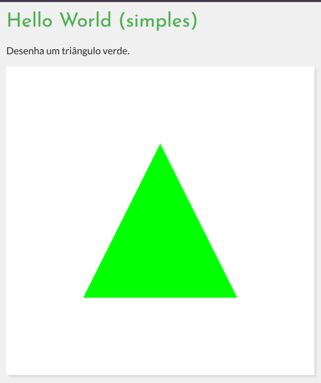

# Hello World (organizado)

Versão levemente mais organizada do exemplo mínimo de WebGL2 que desenha
um triângulo verde. O código separa a inicialização da lógica de desenho
em módulos, usa tags `<script>` para os shaders e exporta funções em
`main.js` (`setupWebGL`, `initialize`, `render`).

Características:
	- 2D
	- VAO e VBO
	- shaders (vertex e fragment) em tags `<script type="shader/...">`
	- atributos de posição em clip space
	- código modular em `main.js` e utilitários em `../utils/code/gl-utils.js`

## Objetivo

Mostrar como organizar um exemplo WebGL simples em módulos e arquivos
separados: inicialização do contexto, compilação e link dos _shaders_,
configuração de VAO/VBO e separação clara entre inicialização e desenho.

## Descrição

O HTML contém duas tags de shader (`shader/vertex` e `shader/fragment`) e
um `canvas`. Em `main.js` há três funções principais:

- `setupWebGL()` — obtém o contexto WebGL2 do `canvas` e valida disponibilidade.
- `initialize(gl)` — lê os _shaders_ do DOM, cria e usa o `program`, cria VAO e
	VBO, envia vértices e configura os atributos. Também define a cor de fundo
	com `gl.clearColor`.
- `render(gl)` — limpa a tela e desenha o triângulo com `gl.drawArrays`.

Os utilitários de criação de _shader_/_program_ estão em
`../utils/code/gl-utils.js`.

## Exercícios

1) Mude a cor de fundo alterando o valor passado para `gl.clearColor(...)`.
2) Transforme o triângulo em um quadrado usando `gl.drawArrays`
(dois triângulos).
